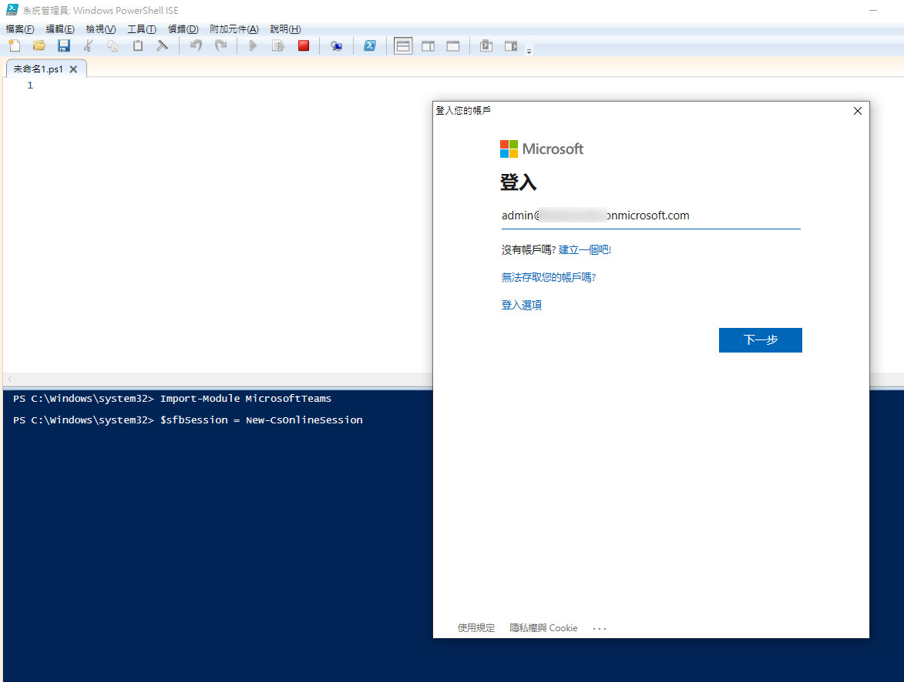
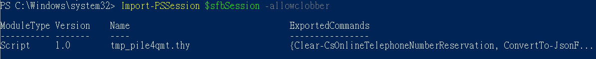
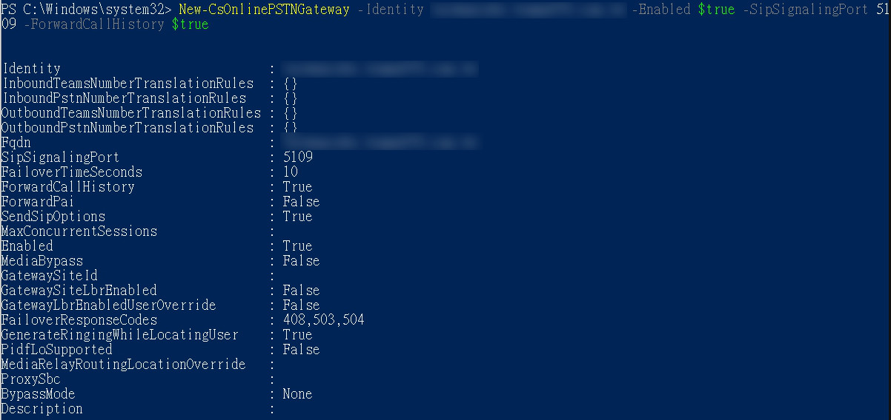
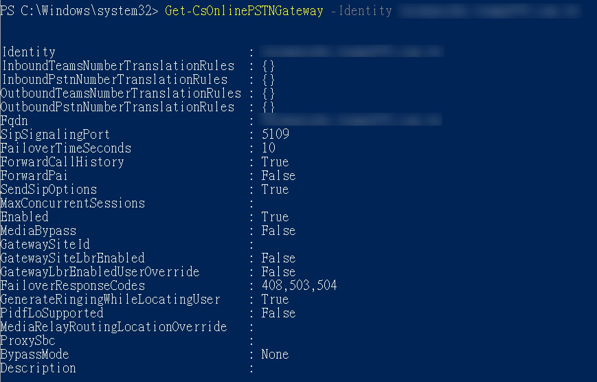

# **使用PowerShell登入Teams**

  - **Step1. 載入Teams Module**<br>
  ```Import-Module MicrosoftTeams```<br>

  - **Step2. 登入Microsoft 365 (Global Admin)**<br>
  ```$sfbSession = New-CsOnlineSession```<br>

    <br>

  - **Step3. 載入PowerShell Session**<br>
  ```Import-PSSession $sfbSession -allowclobber```<br>
   
    <br>
  
  - **Step4. 新增PSTN Gateway**<br>
  ```New-CsOnlinePSTNGateway -Identity ***yourdomain.com.tw*** -Enabled $true -SipSignalingPort 5109 -ForwardCallHistory $true```<br>
  
    請將yourdomain.com.tw，更換為TeleProvider提供的Sub-domain<br>
  
    <br>
  
  - **Step5. 驗證SBC是否已存在於匹配清單之中**<br>
  ```Get-CsOnlinePSTNGateway -Identity yourdomain.com.tw```
 
    <br>
  
