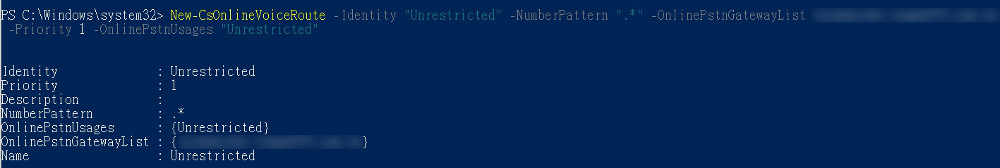

# **Create a trunk and provision users**

  - **Step1. 載入Teams Module**<br>
  ```Import-Module MicrosoftTeams```<br>

  - **Step2. 登入Microsoft 365 (Global Admin)**<br>
  ```$sfbSession = New-CsOnlineSession```<br>

    <br>

  - **Step3. 載入PowerShell Session**<br>
  ```Import-PSSession $sfbSession -allowclobber```<br>
   
    <br>
  
  - **Step4. 新增PSTN Gateway**<br>
  ```New-CsOnlinePSTNGateway -Identity ***yoursubdomain.com.tw*** -Enabled $true -SipSignalingPort 5109 -ForwardCallHistory $true```<br>
  
    請將yoursubdomain.com.tw，更換為TeleProvider提供的Sub-domain<br>
  
    <br>
  
  - **Step5. 驗證SBC是否已存在於匹配清單之中**<br>
  ```Get-CsOnlinePSTNGateway -Identity yourdomain.com.tw```
 
    <br>
  
  - **Step6. 增加Usage**<br>
  ```Set-CsOnlinePstnUsage -Identity Global -Usage @{Add="Unrestricted"}```
 
  - **Step7. 驗證增加後的Usage**<br>
  ```Get-CsOnlinePstnUsage -Identity Global```
  
    <br>

  - **Step8. 設定語音路由規則**<br>
  ```New-CsOnlineVoiceRoutingPolicy "Unrestricted" -OnlinePstnUsages "Unrestricted"```
  
    <br>

  - **Step9. 驗證新的語音路由規則**<br>
  ```Get-CsOnlineVoiceRoutingPolicy```
  
    <br>
    
  - **Step10. 新增語音路由**<br>
  ```New-CsOnlineVoiceRoute -Identity "Unrestricted" -NumberPattern ".*" -OnlinePstnGatewayList yoursubdomain.com.tw -Priority 1 -OnlinePstnUsages "Unrestricted"```
  
    請將yoursubdomain.com.tw，更換為TeleProvider提供的Sub-domain<br>
  
    <br>    

  - **Step11. 驗證新的語音路由**<br>
  ```Get-CsOnlineVoiceRoute -Identity “Unrestricted"```
  
    <br>    
  
    
