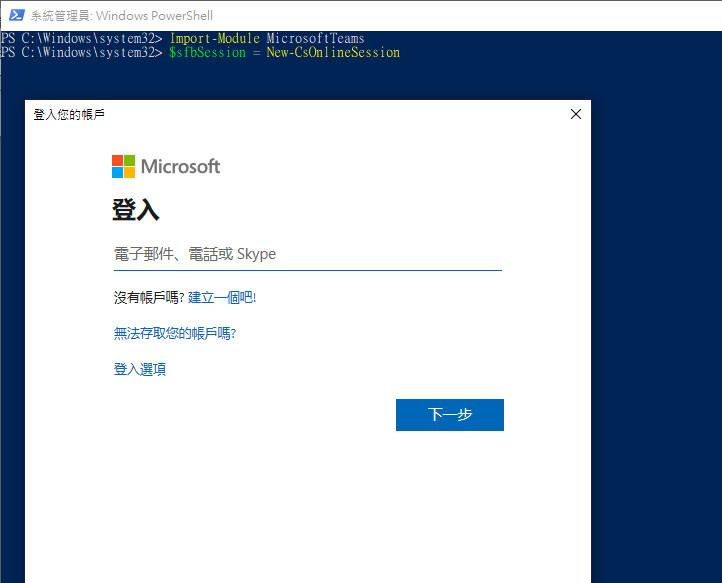

# **使用PowerShell登入Teams**

  建議使用PowerShell ISE操作，並已系統管理員身分執行PowerShell ISE

  - **Step1. 載入Teams Module**<br>
  ```Import-Module MicrosoftTeams```<br>

  - **Step2. 登入Microsoft 365 (Global Admin)**<br>
  ```$sfbSession = New-CsOnlineSession```<br>

    <br>

  - **Step3. 載入PowerShell Sessio**<br>
  ```Import-PSSession $sfbSession -allowclobber```<br>

