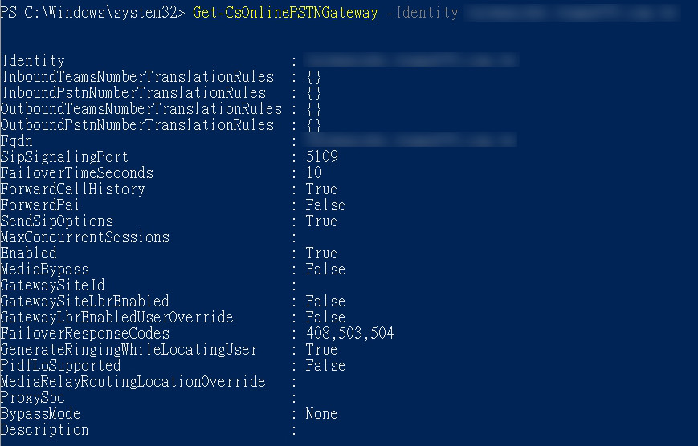

# 必要條件:

- 使用者必須配置「Microsoft 365 Phone System」授權
- 操作人員必須為 全域管理員 或至少 Teams服務系統管理員
- 必須取得由電信商所配發之電話號碼，如070-12345678
- 必須取得由電話交換機(PBX)供應者所提供之Sub-Domain，並完成網域驗證
  網域驗證請參考：https://docs.microsoft.com/zh-tw/microsoftteams/direct-routing-sbc-multiple-tenants#register-a-base-domain-name-in-the-carrier-tenant

# **設定會話邊界控制器與使用者配置**

  - **Step1. 載入Teams Module**<br>
  ```Import-Module MicrosoftTeams```<br>

  - **Step2. 登入Microsoft 365 (Global Admin)**<br>
  ```$sfbSession = New-CsOnlineSession```<br>

    <br>

  - **Step3. 載入PowerShell Session**<br>
  ```Import-PSSession $sfbSession -allowclobber```<br>
   
    <br>
  
  - **Step4. 新增PSTN Gateway**<br>
  ```New-CsOnlinePSTNGateway -Identity ***yoursubdomain.com.tw*** -Enabled $true -SipSignalingPort 5109 -ForwardCallHistory $true```<br>
  
    請將yoursubdomain.com.tw，更換為TeleProvider或PBX提供的Sub-domain<br>
  
    <br>
  
  - **Step5. 驗證SBC是否已存在於匹配清單之中**<br>
  ```Get-CsOnlinePSTNGateway -Identity yourdomain.com.tw```
 
    <br>
  
  - **Step6. 增加Usage**<br>
  ```Set-CsOnlinePstnUsage -Identity Global -Usage @{Add="Unrestricted"}```
 
  - **Step7. 驗證增加後的Usage**<br>
  ```Get-CsOnlinePstnUsage -Identity Global```
  
    <br>

  - **Step8. 設定語音路由規則**<br>
  ```New-CsOnlineVoiceRoutingPolicy "Unrestricted" -OnlinePstnUsages "Unrestricted"```
  
    <br>

  - **Step9. 驗證新的語音路由規則**<br>
  ```Get-CsOnlineVoiceRoutingPolicy```
  
    <br>
    
  - **Step10. 新增語音路由**<br>
  ```New-CsOnlineVoiceRoute -Identity "Unrestricted" -NumberPattern ".*" -OnlinePstnGatewayList yoursubdomain.com.tw -Priority 1 -OnlinePstnUsages "Unrestricted"```
  
    請將yoursubdomain.com.tw，更換為TeleProvider或PBX提供的Sub-domain<br>
  
    <br>    

  - **Step11. 驗證新的語音路由**<br>
  ```Get-CsOnlineVoiceRoute -Identity “Unrestricted"```
  
    <br>    
  
  - **Step12. 為使用者更新Teams原則**<br>
  ```Grant-CsTeamsUpgradePolicy -PolicyName UpgradeToTeams -Identity user@yoursubdomain.com.tw```
  
    注意，擁有此原則的用戶未來將僅能使用Teams(Teams-Only)。除了加入Skype for Business會議外，他們將不再能夠使用Skype for Business用戶端。 
    有關詳細信息，請參見：http://aka.ms/UpgradeToTeams
  
    <br>       

  - **Step13. 為使用者配置電話號碼與啟用企業語音信箱套件**<br>
  ```Set-CsUser -id user@yoursubdomain.com.tw -EnterpriseVoiceEnabled $true -HostedVoiceMail $true -OnPremLineURI tel:+88601234567890```
  
    請將yoursubdomain.com.tw，更換為TeleProvider或PBX提供的Sub-domain<br>
    
    請將tel:+88601234567890，更換為TeleProvider提供的電話號碼<br>
  
  - **Step14. 為使用者分配語音路由原則**<br>
  ```Grant-CsOnlineVoiceRoutingPolicy -Identity user@yoursubdomain.com.tw -PolicyName "Unrestricted"```
  
    
  - **Step15. 驗證使用者的配置**<br>
  ```Get-CsOnlineUser -id user@yoursubdomain.com.tw | fl UserPrincipalName, EnterpriseVoiceEnabled, OnPremLineURI, DialPlan, VoicePolicy, HostedVoiceMail, OnlineVoiceRoutingPolicy, TeamsCallingPolicy, TeamsInteropPolicy, AssignedPlan, TeamsUpgradeEffectiveMode```
  
    <br>
  
     此外，您也可以登入您的Teams管理中心確認使用者的配置狀況 - 
  
    <br>
